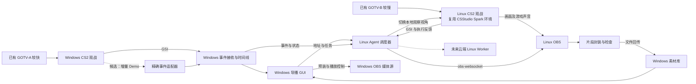

# Project Replay：CS2 双端回放系统规划

> 2026-09-18：当前采用切人后立即 StartRecord、无冲突任务排队、转码回传与采集分离；不使用回放缓冲预热。两端 epoch 自动转换。详见 [当前录制流程](自动录制流程与后台渲染.md)，下文保留早期技术调研。

研究日期：2026-09-16。修订：已参考本机 CSStudio 的源码、运行报告和现存素材；本次未启动新录制或进行实时 GOTV 联机实测。详见 [CSStudio 复用评估](CSStudio复用评估.md)。

## 1. 已确认条件与结论

用户确认：Windows 桌面端与 NVIDIA DGX Spark 在本地局域网互联；比赛已有两路 GOTV，延迟可以自定义；不能在比赛服务器安装插件；未来增加云端 Linux 节点。

最新窗口要求：每次选定击杀只回放前 1 秒、后 1 秒，目标 2 秒。Windows 负责多个击杀冲突时的选择，详见 [Windows 击杀选择与两秒回放算法](Windows击杀选择与两秒回放算法.md)。内部允许多录保护量，输出窗口不随之延长。

目标链路：Windows 从较快一路观察比赛，识别击杀并下发任务；Linux 在较慢一路提前切到目标选手，使用 OBS 录制，回传片段；导播在 Windows GUI 预览、选择、送入 Windows OBS 播放。

**以 CSStudio 已有录制能力为基础，开发实时 GOTV 适配和 Windows 导播端。** 当前结论修订如下：

1. **Spark 录制已有本机依据。** CSStudio 通过 Steam/FEX、独立 Xorg、NetCon 和原生 OBS 完成了离线 Demo 录制。现存正式任务报告含 92 段成功记录，92 个素材文件均存在且非空；本次 ffprobe 抽检一段确认 H.264/AAC、1920×1080、60 fps。复用这套部署，补验实时 GOTV 接入和持续运行，不再以 ARM64 本身作为立项阻碍。
2. **精确 tick 来源。** 不能把 GSI 状态变化等同于逐条、无损、带权威 tick 的击杀事件流。无服务器插件条件下，精确事件需要另外验证 Demo 或 CSTV+ 解析；只有 GSI 时，tick 必须允许为空。
3. **延迟自定义已确认。** 将 A/B 路延迟及目标差值纳入会话配置；仍需确定通过软件接口还是人工配置生效，并校准客户端实际时间差。调整延迟的能力不等于已存在可供新软件调用的管理 API。

建议先交付“技术验证版 P0”，通过门槛后再开发“单比赛、单录制视角、人工选播的 V1”。以下涉及指标和时间均为拟定目标或算例，不是设备实测结果。

## 2. 概念与职责边界

| 概念 | 项目中的含义 |
|---|---|
| GOTV-A | 时间线较快的一路，供 Windows 识别事件；对应用户的端口1角色 |
| GOTV-B | 时间线较慢的一路，供录制节点观战；对应用户的端口2角色 |
| 端口名称 | 逻辑角色，不假定实际端口号，也不假定其对应引擎实例编号 |
| player_id | 选手身份，优先使用字符串格式 SteamID64 |
| event_id | 本系统生成的稳定击杀事件标识，不称作 Valve 原生击杀 ID |
| observer_slot | GSI 的观察者代号；不能直接等同于 NetCon `spec_player` 参数 |
| spec_player_slot | CSStudio 已验证的切人命令参数，现有 Demo 模式按 `user_id + 1` 生成，实时模式另验 |
| tick | 必须说明所属地图会话、时间线和来源的事件 tick |
| effective_delta | 同一比赛时刻在两客户端实际出现的墙钟时间差 |

Windows 向 Spark 下发的是 B 路的地址、端口、必要凭据、任务及时间线信息。**GOTV 是游戏状态广播，不是 OBS 可直接播放的视频流。** 首选让录制节点直接连接已有 B 路。

若 B 路只允许 Windows 访问，可另行研究网络隧道或协议兼容的中继。普通端口转发不产生第二路可控延迟 GOTV，不能简单通过缓存 UDP 包实现可靠的任意延迟播放器。

## 3. 资料核实与证据边界

| 能力 | 研究结果 | 对项目的影响 |
|---|---|---|
| Spark CPU/GPU | NVIDIA 文档标明 ARM64、Blackwell 集成 GPU，并列出 NVENC/NVDEC | 有编码硬件不等于当前 OBS 构建和驱动已经可用，需探测 |
| CS2 Linux 客户端 | 本机 CSStudio 已有 FEX 环境及真实录制产物 | 复用已有环境，验证实时模式；不宣称 ARM64 原生游戏 |
| 两路延迟配置 | Valve 赛事配置文档列出 `tv_delay`、`tv_delay1` | 证明存在相关配置概念；现有服务器的实例、权限和动态改值效果仍需验证 |
| GSI | 接收游戏 HTTP JSON 状态，库可由状态差分生成事件 | 状态差分存在信息损失，不能保证精确击杀配对或 tick |
| Demo/CSTV+ 解析 | demoinfocs 提供击杀解析与 HTTP 广播解析示例 | 可作为精确数据候选，但普通 GOTV 端口不是 CSTV+ URL |
| OBS 远程控制 | obs-websocket 提供录制、回放缓冲、媒体源和场景操作 | 适合实现录制与 Windows 出片控制 |

资料来源：[Valve 赛事配置及 CSTV 测试](https://github.com/ValveSoftware/counter-strike_rules_and_regs/blob/main/major-supplemental-rulebook.md)、[GSI 实现说明](https://github.com/antonpup/CounterStrike2GSI)、[demoinfocs](https://github.com/markus-wa/demoinfocs-golang)、[广播解析示例](https://github.com/markus-wa/demoinfocs-golang/blob/master/examples/broadcasts/broadcasts.go)、[OBS 协议](https://github.com/obsproject/obs-websocket/blob/master/docs/generated/protocol.md)。

上述开源库文档属于维护者的一手实现资料，不等于 Valve 对所有版本行为的保证。Valve Developer Community 的 GSI 页面本次读取失败，不将其未读取内容当作证据。实际开发应固定验证过的版本；不要直接跟随解析库的 master 分支。

## 4. 无服务器插件时的事件来源

### 4.1 GSI：即时触发与选手状态

Windows 观战客户端发送 GSI 到本机接收服务，再由服务整理后发往 Linux。Linux 观战客户端也发送自己的 GSI，供身份匹配、视角确认和双路对时。

重点采集：玩家身份、观察者槽位、存活状态、击杀/死亡统计、回合、地图、当前观察对象。保存原始样本用于回放调试，并验证目标版本的字段实际可用性。

由击杀数递增可以发现候选事件，但在同一批更新中多人死亡、多人击杀、断流、重连、回合重置时，不能仅凭计数可靠恢复事件顺序和杀人者—死者关系。累计变化大于 1 时不能任意拆成若干“精确事件”。`provider.timestamp` 和本机收到消息的时间都不能直接换算成权威击杀 tick。

设计两种质量等级：

- `inferred`：GSI 推断，只保证候选状态变化；未知死者或 tick 留空。
- `verified`：从已验证的 Demo/广播事件读取身份与 tick，并记录来源。

先推断触发、后精确补全时，保留原 event_id，通过关联关系更新，不重复创建录制任务；无法唯一关联的候选保持待核验。

### 4.2 精确数据的候选路径

| 路径 | 必要条件 | 首版定位 |
|---|---|---|
| 已有 CSTV+ HTTP 广播 | 组织方已经提供 URL/访问权限，且数据延迟足够小 | 条件满足时优先验证 |
| Windows A 路本地录制 Demo并增量解析 | 当前 CS2 允许该观战模式录 Demo，文件能边写边读，解析器支持未完成数据等待 | 主要实验路径，不提前承诺可行 |
| 已完成的 Demo | 能拿到匹配当前地图会话的文件 | 离线核验和补录，不能保证实时触发 |
| 服务器事件插件 | 服务器可安装插件 | 用户已排除，不列为首版依赖 |

增量 Demo 需要验证：文件刷新频率、共享读权限、截断消息处理、EOF 后继续等待、事件完整性、观战 Demo是否包含所需玩家事件、游戏更新兼容性、事件 tick 与显示时间的关系。

禁止把网络抓包直接解析普通 GOTV 作为现成能力假设；实现完整协议客户端属于额外研发项目。

**如果精确数据路径均不成立，原始“实时精确击杀 tick”要求未满足。** 此时只能提供清晰标记的 GSI 近似模式，是否接受作为 V1 需在 P0 结果中明确决策，不能静默降级。

### 4.3 身份和观察者代号

任务以 SteamID64 指定目标，名字用于显示。分别记录 `gsi_observer_slot`、`engine_user_id`、`spec_player_slot`，三者不能混用。CSStudio 的真实样本使用过 `spec_player_slot=14`，所以不能按键盘数字代号的 0～9 范围校验命令参数。现有 `user_id + 1` 规则已有 Demo 代码和产物依据，但仍需核验实时 GOTV 模式。

Linux 的 B 路状态适配器负责提供带会话、时间和证据的映射，执行器按已确认目标切人并用新鲜 GSI 验证 SteamID。这里是确定性身份解析，不是让录制机自行选择选手。两端因时间线不同，不能直接共用一个无时间戳的槽位映射。

维护 `match_id + map_session_id + timeline_epoch + steamid64`；换图、回档、重新连接导致时间线失效时增加 epoch，撤销旧计划。机器人或没有有效 SteamID 的对象使用会话内 ID，避免空身份碰撞。

## 5. Spark 部署决策

### 路线 A：首选，复用 CSStudio 的两机部署

Windows 为导播台，Spark 本机运行 CS2 观战客户端、Linux Agent、OBS 和媒体处理。

本机已有明确技术路线：Steam/FEX → NVIDIA Xorg `:20` → CS2 → 原生 OBS XSHM 捕获及独立音频输出。沿用已有 x264 编码配置，不重新选择 Box64、不重新搭建一套基础录制环境。依据见 [CSStudio 无头部署说明](</home/water/Project Autocs2video/HEADLESS.md>) 及复用评估中的现存任务报告。

P0 集中验证已有客户端连接真实 GOTV、在线切人及时间线查询、断线恢复、与离线 CSStudio 任务互斥。沿用图形与音频会话，不在规划阶段改动服务或启动参数。离线启动参数是否适用于目标 GOTV 接入，应在接入测试中确认。

### 路线 B：兼容性失败时的建议备选

Spark 继续承担调度、事件处理、文件处理与存储；增加或复用 x86_64 GPU 渲染节点运行 CS2+OBS。渲染节点可在局域网，未来也可在云端。

此路线仅作为未来扩容或故障替代，不是当前立项前提。它改变“两台机器”的原始部署条件。复用 Windows 额外运行录制实例也需要验证性能、Steam 会话、多实例、输入焦点及音频隔离。

软件从第一天分离 `Coordinator` 和 `RenderWorker`，同机部署时无需用户感知；这样能保留 Spark 路线，同时避免被某一种硬件锁死。

## 6. 推荐逻辑架构



Windows 模块：比赛会话配置、GSI 接收、可选精确事件解析、事件归一化、任务队列、素材下载与校验、SQLite 元数据、GUI、OBS 播放适配器。

Linux 模块：能力探测、连接会话管理、时间线校准、单视角资源调度、观察控制、OBS 控制、片段处理、回传、健康监控。

保留五个稳定边界：`EventSource`、`TimelineProvider`、`ObserverController`、`Recorder`、`ArtifactStore`。以后替换事件源、增加云节点不改变 GUI 的业务模型。

## 7. 延迟与时序模型

### 7.1 三种不同的“延迟”

1. 广播配置延迟：服务器或广播系统对 A/B 路的配置。
2. 实际时间线差：同一事件在两个客户端呈现的真实时间差，包含缓冲、网络及客户端因素。
3. 回放就绪时间：录制完成、封装、传输和校验后，素材可以在 Windows 播放的时刻。

GUI 分别显示“A/B 配置延迟”“目标时间差”“实测时间差”“误差范围”“预计就绪时间”。用户已确认延迟可调；软件显示配置的实际生效状态，不能把输入框改值当作已经修改成功。

### 7.2 可录制条件

令：

- `D_A/D_B`：同一事件在 A/B 客户端呈现相对比赛源的有效延迟。
- `Δ = D_B - D_A`，要求 B 落后 A，且 Δ 为正。
- `L_detect`：事件在 A 呈现后，到 Windows 识别完成的延迟；精确解析可能比 GSI 更慢。
- `L_control`：任务传输及调度延迟。
- `S`：切换到正确第一人称且确认稳定的时间。
- `P/Q`：击杀前/后的播出长度，首版固定各 1 秒；原始采集另外保留保护量 g。
- `W`：收集附近候选、比较多个视角的规划等待预算。
- `g`：单侧采集保护量，覆盖允许的定位误差及采集抖动。
- `M`：抖动和对时误差预留。

完整录到击杀前 P 秒的必要条件近似为：

```text
Δ >= L_detect + W + L_control + S + P + g + M
```

该式用于规划，实际调度基于 B 路当前播放进度和置信区间。不能只在收到击杀消息后固定等待 Δ 秒；那样会等到 B 路击杀已经发生才切视角。

算例：P=Q=1 秒，识别 0.3 秒、规划等待 0.5 秒、传输调度 0.05 秒、切人及准备 0.5 秒、单侧保护 0.2 秒、余量 0.5 秒。所需时间差约 3.05 秒；可将更大的值作为联调起点，具体值由实测决定。这些数字不是本机性能结论。

从 A 路看到该击杀到素材就绪，约为：

```text
T_ready ≈ Δ + Q + g + T_finalize + T_transfer + T_verify
```

若 Δ=5 秒、Q=1 秒、g=0.2 秒，最后三个步骤合计 1 秒，则约 7.2 秒后可播放。这是示例而非 SLA；同人连续录制共用原片时，较早事件可能还需等待原片结束和封装。提高 B 路延迟能增加准备和选择时间，也会推迟回放就绪。

回放就绪时间不得只以 2 秒文件长度估算，需包含 Δ 和实际处理耗时。GSI 推断时间存在误差时，2 秒文件长度不等于击杀精确居中，精确模式需要另行定位。

### 7.3 自定义延迟的实现等级

| 环境 | 可实现的控制 |
|---|---|
| 当前已确认：延迟可自定义 | 配置 A/B 延迟或差值，再测量真实结果；不假定改值即时生效 |
| 管理 API 尚未接入 | 先支持录入已设置值及校准；获得实际接口后实现软件下发 |
| 会话中修改延迟 | 暂停新任务、处理在录窗口、应用配置、等待稳定、重新校准后恢复 |

不能靠延后发送控制命令改变比赛播放时间线；OBS 视频延迟也不能让 CS2 回到过去换视角。原规划中的“是否能自定义延迟”已解除，后续只验证具体接口、边界和生效过程。

### 7.4 时钟与游戏时间

控制协议进行往返测量并估算两台机器的时钟偏移和不确定性；任务内部使用单调时钟，UTC 用于日志。

优先利用可获取的同源 tick/事件锚点建立分段时间映射；仅有 GSI 时，用双方回合、炸弹、选手状态变化等多锚点估计 Δ，并公开误差。回合倒计时在暂停和阶段变化时不能当作线性主时钟。

拿到准确事件 tick 不等于已经能在 Linux 当前画面精准执行该 tick。B 路播放进度、渲染与捕获延迟仍需校准；不能把服务器 tick、Demo 帧号、GOTV 快照率、视频帧率当作同一个量。

暂停、卡顿、回档、换图或重连后，冻结未执行任务并重新校准。迟到任务标记 `missed_window` 或明确缩短前置长度，不伪报完整片段。

## 8. 自动切视角与单机容量

优先复用 CSStudio `recorder/vconsole.py` 的 NetCon 和 `RealBackend.setup_camera()`：`spec_mode 1` → `spec_player <已确认命令槽位>` → 独立 GSI SteamID 确认。现有路径已在 Demo 任务使用，P0 只补验实时 GOTV 的行为与映射。不要把 RCON 当作本地客户端控制接口。

观察控制器步骤：在 B 路状态中解析目标身份 → 切换 → 校验当前观察者身份和视角模式 → 等待稳定 → 标记可录制。自动导播/跟随主导播若抢回镜头，应检测并停用冲突模式。沿用专用图形会话。现有 GSI 只确认开录前身份；实时版本增加录制期间监测和异常记录，不把既有 `camera_verified=true` 理解为全程正确视角。

**一个 CS2 渲染实例同时只能提供一个视角。** 首版策略：

- 同一选手相邻击杀可共用连续原始录制，每次击杀仍分别输出前后各 1 秒；不默认合并成更长播出片段。
- Windows 按“已锁定任务不抢占 → 手动指定 → 最大化完整覆盖击杀数 → 有证据的主画面漏看 → 连杀偏好 → 少切镜头 → 稳定排序”选择。
- 在未锁定时间范围内，用兼容窗口图的最长路径算法滚动重算，计入保护量和切人/录制转换耗时；不能仅按消息先到顺序决定。
- GUI 提示被覆盖/未录到的事件及原因，不能把任务简单排到事件经过之后。
- OBS 缓冲只能保存已渲染的画面，不能事后恢复当时没有观察的其他选手视角。
- 补录依赖可回看的 Demo；实时 B 路不默认支持任意倒退。多视角并行留待增加 Worker 后实现。

## 9. OBS 录制、回传与 Windows 输出

首个纵向原型复用 CSStudio 已有 OBS StartRecord/StopRecord、录制状态确认、文件检查和报告。通过提前量启动录制，避免一次引入过多变化。新增实时会话应保持客户端在线，不能沿用每批结束后的游戏/Steam/OBS 清理流程。

OBS 回放缓冲作为后续优化候选：比赛开始预热缓冲；调度器提前切人；过击杀后 Q 秒再保存；串行匹配完成事件和文件路径。现有代码尚未证明此路径可用，需要独立验收。窗口冲突仍由上层调度解决。

首版最终录制方式由实测启动成本、边界准确性及稳定性决定。OBS 请求成功和素材完成是不同状态。相关请求与完成事件见 [obs-websocket 协议](https://github.com/obsproject/obs-websocket/blob/master/docs/generated/protocol.md)。

切片步骤：保存完成 → 检查可读性、时长及音视频轨 → 根据捕获时间映射裁剪 → 生成缩略图及元数据 → 回传。不把 OBS 文件时间直接当成击杀 tick。若要求精确到视频帧的边界，需验证解码重编码裁剪；直接 stream copy 可能受关键帧限制。[FFmpeg 文档](https://ffmpeg.org/ffmpeg.html)。

媒体基线沿用已存在的 1080p60、H.264、AAC、MKV，以及 CSStudio 的 x264 配置。部署文档记录的独立 NVENC 试验不等于 OBS 生产链路验收，硬件编码留作优化。片段按 Windows 播放兼容性重封装。

回传采用带身份验证的 HTTP 文件接口、断点续传、长度与 SHA-256 校验。Windows 先写临时文件，校验后原子改名；只把完成文件加入“可播”素材库。首版避免依赖 SMB 共享路径，从而方便未来云端迁移。

容量算例：20 Mbps 视频的 2 秒成品约 5 MB，未计音频及容器；原始录制因为保护量和同人连续片段会更大。5 MB 在理想 1 Gbps 链路上的纯传输下限约 0.04 秒，不代表端到端就绪时间。两小时持续 20 Mbps 视频约 18 GB，缓存清理和可用空间必须可见。

Windows 输出推荐直接控制 OBS 的本地媒体源，避免把 GUI 窗口捕获成节目视频。为两个媒体源 A/B 分别预装片段，导播点击“播出”时切到准备好的源；播放完成后按既定模式返回直播场景，保留随时“返回直播”按钮。

GUI 预览与节目输出独立；新素材到达不得自动抢占节目。保存切出前的直播场景，仅在本系统仍持有当前播放会话时自动返回，避免覆盖导播中途手工切换。游戏音频随片段走，解说/现场音单独保留在 Windows OBS，避免双路游戏声音或解说重复。

## 10. Windows GUI 功能规划

```text
┌ 比赛/地图/回合 ─ A/B连接 ─ 实测时间差±误差 ─ Linux/OBS/磁盘状态 ┐
│ 击杀事件列表       │ 选中片段预览              │ 回放播放列表    │
│ 选手、回合、来源   │ 前后置范围、视角确认      │ 排序/移除/锁定 │
│ 待录/录制/回传     │ 时长、tick或“未知”        │ 预计就绪时间   │
│ 可播/冲突/失败     │ 手动标记、加入列表        │ 当前节目状态   │
├ 素材缩略图：按回合/选手/可播状态筛选                           ┤
│ 预览播放   加入待播   播出所选   返回直播   暂停自动采集         │
└ 日志与异常：重连、校准失效、错视角、迟到、回传失败              ┘
```

V1 包含连接向导、事件列表、自动冲突选择及手动锁定、固定 2 秒片段预览、定位校正、播放列表、快捷键、OBS 状态、选择与失败原因。定位校正保持前后各 1 秒窗口。精确字段有来源标签；“等待确认 tick”不能显示成 0。

V1 包含上述确定性选择规则，暂不包含 AI 精彩评分、AI 镜头决策、十人并发全视角、跨比赛调度、任意历史时刻即时重渲染和复杂慢动作。

## 11. 协议与数据模型草案

控制：持久 WebSocket + JSON，具有协议版本、消息 ID、会话 ID、顺序号、确认、重连和幂等处理。文件：独立 HTTP 传输，不能用大文件堵住控制通道。局域网首次配对分发节点凭据，OBS 默认仅对本机 Agent 开放。

关键消息：`hello/capabilities`、`session.configure`、`event.upsert`、`timeline.status`、`job.submit`、`job.cancel`、`job.status`、`artifact.ready`、`heartbeat`。支持端报告是 arm64/x64、是否能够渲染/切人/录制，而不是仅报告“在线”。

以下是本系统的协议草案，不是游戏原生载荷：

```json
{
  "protocol_version": 1,
  "message_id": "msg-example-001",
  "type": "event.upsert",
  "event": {
    "event_id": "evt-example-001",
    "match_id": "match-example",
    "map_session_id": "map-session-example",
    "timeline_epoch": 1,
    "round_index": 7,
    "kind": "kill_candidate",
    "source": "gsi_diff",
    "quality": "inferred",
    "killer_steamid64": "76561198000000001",
    "victim_steamid64": null,
    "gsi_observer_slot_hint": 3,
    "engine_user_id": null,
    "spec_player_slot": null,
    "slot_source": "gotv-a",
    "event_tick": null,
    "tick_domain": null,
    "observed_at_utc": "2026-09-16T08:00:00.000Z"
  }
}
```

任务另含 `job_id`、目标身份、前后置秒数、优先级、时序锚点、可接受误差、有效期；片段另含 `artifact_id`、关联事件、实际视角、实际起止边界及精度、编解码信息、时长、字节数、hash、保存位置。

状态机：

```text
DETECTED → SCHEDULED → ARMED → CAPTURING → FINALIZING
         → TRANSFERRING → READY → QUEUED → PLAYING → PLAYED
失败分支：MISSED_WINDOW / CONFLICT / WRONG_TARGET / FAILED / CANCELLED
```

恢复时以持久化 job_id 对账，避免网络重试造成重复录制或重复播出。换图或回档后旧 epoch 任务不执行。原始候选、核验事件、素材及播放记录分表存储，方便核对漏录率。

## 12. 技术栈建议

| 部分 | 建议 | 理由及边界 |
|---|---|---|
| Windows 桌面 | C#/.NET + WPF | Windows 专用导播台，适合本地文件和系统集成；视频预览组件另做 P0 选型 |
| Linux 执行服务 | Python 3.12 + CSStudio 录制模块 + 新的实时会话层 | 复用已验证代码；通过版本化 JSON 与 Windows 通信，不为了统一语言重写 |
| 精确解析适配器 | 优先复用 demoparser2 的事实模型和离线核验 | 增量能力单独验证；若采用 CSTV+，再按需求引入 demoinfocs 进程 |
| 游戏控制 | 复用 NetCon + 独立 GSI 身份确认 | 新增实时身份映射和持续监控 |
| 录制/节目输出 | OBS + obs-websocket 5.x 协议适配 | 启动时检查可用请求，避免假设不同版本完全一致 |
| 媒体处理 | FFmpeg/ffprobe | 时长检查、缩略图、裁剪、封装 |
| 元数据 | 各节点 SQLite + 文件系统 | 单比赛无需引入数据库集群 |

CSStudio 的 Python/GTK 桌面工作台可参考业务模型，不作为 Windows GUI 的直接移植前提。WPF 的定位见 [Microsoft 文档](https://learn.microsoft.com/en-us/dotnet/desktop/wpf/overview/)。实现前固定支持的 Windows、DGX OS、驱动、CS2、OBS 和解析器版本。源码复用时保留既有许可证和来源记录。

建议代码结构：

```text
apps/windows-director/
services/replay-agent/
services/demo-event-adapter/
packages/contracts/
packages/timeline/
packages/scheduling/
adapters/observer-linux/
adapters/obs/
tests/fixtures/
docs/
```

## 13. 分阶段开发与验收

按一名熟悉桌面、网络和媒体链路的工程师估算：复用核查已完成；实时适配 P0 暂估 3～5 个工作日，P0 通过后的基础 V1 约 4～6 周。精确事件采集若需额外研究，单独估算；不再把 Spark 基础转译部署计为从零研发。

| 阶段 | 交付物 | 继续开发的条件 |
|---|---|---|
| P0 实时适配验证 | GOTV 连接/切人、GSI 样本、事件来源报告、可调双路延迟曲线 | 实时进度来源与精确事件路径有明确结论 |
| P1 纵向链路 | 手动指定选手→Linux切人→OBS保存→Windows收片→OBS播放 | 人工触发链路连续成功，可定位每一步耗时 |
| P2 事件与调度 | 自动候选、身份映射、校准、去重、冲突与迟到处理 | 自动任务不串视角、不冒用精确 tick |
| P3 导播界面 | 素材库、预览、列表、快捷键、返回直播、状态提示 | 预览不影响节目，播出状态可核验 |
| P4 稳定性与交付 | 安装包、配置导出、诊断日志、恢复说明 | 完成长时观战和异常演练 |

### P0 具体实验

1. **实时链路**：复用现有 Spark/FEX/Xorg/OBS 环境，在独占录制会话中连接真实 GOTV，验证 NetCon 切人、持续 GSI、1080p60 录制和断线恢复；不重新安装基础环境。
2. **数据链路**：采集完整回合 GSI，覆盖同 tick 多击杀、连续击杀、自杀/世界伤害、断线重连；对照 Demo 或人工逐帧记录，标明推断失败场景。
3. **精确解析**：核实是否存在 CSTV+ URL；否则测试观战本地 Demo 的增量读取。测从 A 路画面出现击杀到精确事件可用的 P50/P95/P99 延迟。
4. **双路对时**：同一会话同时连接 A/B，记录至少 20 个共同锚点、实际 Δ 分布；覆盖暂停、换边、回合重置和重连。
5. **切人闭环**：重复切换至少 100 次，测身份确认、视角模式和稳定时间；验证不会被主导播覆盖。
6. **文件及播出**：反复保存、断网恢复、hash校验、预装播放、人工中断和返回直播，确认音视频及任务不串。

拟定 V1 验收目标，须由 P0 实测校正：

- 连续观战和工作 2 小时，无进程崩溃；录制丢帧比例目标 <1%，记录实际表现。
- 在满足提前量且无资源冲突的样本中，正确视角片段成功率目标 ≥99%；被冲突排除样本单独统计，不能藏进分母。
- 200 个事件对照样本全部有可追踪记录；精确模式逐条核对身份、tick及其时间域，近似模式独立报告误差。
- 回传文件 hash 校验全部通过；模拟中断后能恢复，无损坏文件被列为可播。
- 连续 100 次播放切换不串片；预览不抢节目，返回直播可用。
- 所有失败有明确状态；对时误差超过允许前置余量时暂停自动录制。
- 用户若坚持精确 tick，只有数据路径验证通过才能标记满足 V1；近似模式成功不能代替此验收。

## 14. 云端第三端的扩展方式

第三端作为另一种 Worker 接入同一协议，携带节点能力、地理位置/延迟、可用存储和任务容量；Windows 仍保留导播控制与本地素材缓存。

云端渲染需单独验证 x86_64 GPU、Vulkan/桌面、Steam 会话、观战权限、编码能力，以及比赛广播是否允许云端连接。普通 CPU Linux VPS 可以承担调度/存储，但不能直接等同于游戏渲染节点。

扩展时加入 TLS、节点认证、出站连接中继、对象存储下载、任务租约与心跳、带宽预算。调度器把 WAN 延迟、上传速度和源端广播延迟纳入提前量和就绪时间；不在 V1 引入多租户或集群编排。

## 15. 当前待确认事项及决策顺序

已确认的 Spark 型号、禁止服务器插件、已有两路 GOTV、延迟可自定义及 CSStudio 离线录制基础无需重新确认。剩余环境信息用于 P0：

1. 两路实际地址、A/B 当前延迟及调整延迟的具体入口；是否另有 CSTV+ URL。
2. 实时 GOTV 的接入与观战条件，以及 CSStudio 离线作业和 Replay 使用同一录制会话的时间安排。
3. Windows 的 CPU/GPU、OBS 配置、Steam/观战会话条件，以及可接受的回放就绪时间。

执行顺序：沿用 CSStudio 录制底座 → 验证实时 GOTV 进度和精确事件来源 → 校准可调双路提前量 → 打通手动录制回传与 Windows OBS → 开发自动调度和完整 GUI。以上未验证项都保留在需求跟踪中。
